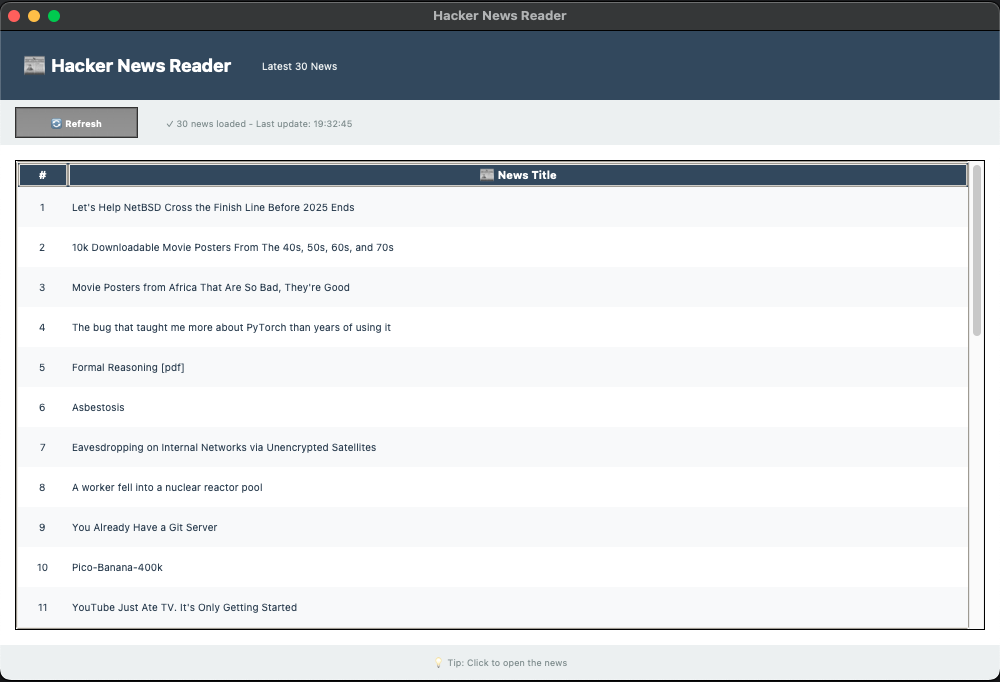

# 📰 Hacker News Reader

A modern, elegant desktop application built with **Python** and **Tkinter** that fetches and displays the latest 30 posts from [Hacker News](https://news.ycombinator.com/).


---

## 📑 Table of Contents

- [Overview](#overview)
- [Features](#features)
- [Screenshots](#screenshots)
- [Getting Started](#getting-started)
  - [Prerequisites](#prerequisites)
  - [Installation](#installation)
  - [Usage](#usage)
- [Project Structure](#project-structure)
- [Contributing](#contributing)
- [License](#license)

---

## 🧭 Overview

**Hacker News Reader** is a GUI-based Python application that provides a clean interface to browse Hacker News stories. Built with:

- **Requests** and **BeautifulSoup4** for web scraping
- **Tkinter** for the graphical user interface
- **Threading** for smooth, non-blocking data loading

The app fetches the 30 most recent posts from Hacker News and displays them in a scrollable, clickable table. Each entry can be opened directly in your default browser with a single click.

---

## ✨ Features

- 🔄 Fetches the **latest 30 Hacker News articles** in real-time
- 🖱️ **One-click access** - Click any title to open in your browser
- ⚡ **Refresh button** for manual updates
- 🧵 **Multi-threaded loading** - UI stays responsive during data fetching
- 🎨 **Modern interface** with clean design and intuitive layout
- 📊 **Status bar** showing loading progress and last update time

---

## 🖼️ Screenshots



---

## ⚙️ Getting Started

### 🧩 Prerequisites

Before running this project, ensure you have:

- **Python 3.7+** installed
- **pip** (Python package installer)

> 💡 **Note:** Tkinter is included with most standard Python installations.

### 💾 Installation

1. **Clone the repository**
```bash
git clone https://github.com/emircanmurat/HNReader.git
cd HNReader
```

2. **Create a virtual environment (recommended)**
```bash
python3 -m venv venv
source venv/bin/activate
```

3. **Install dependencies**
```bash
pip install -r requirements.txt
```

### ▶️ Usage

Run the application:
```bash
python main.py
```

**How to use:**
1. The app window will launch automatically
2. Wait for the latest 30 news titles to load
3. Click any title to open it in your default browser
4. Use the **Refresh** button to reload and update the list

---

## 🗂 Project Structure

```
HNReader/
│
├── main.py              # Main application file
├── requirements.txt     # Python dependencies
├── .gitignore          # Git ignore rules
└── README.md           # Project documentation
```

---

## 🤝 Contributing

Contributions are welcome! Feel free to:

1. Fork the project
2. Create your feature branch (`git checkout -b feature/AmazingFeature`)
3. Commit your changes (`git commit -m 'Add some AmazingFeature'`)
4. Push to the branch (`git push origin feature/AmazingFeature`)
5. Open a Pull Request

---

## 📄 License

This project is licensed under the MIT License - feel free to use, modify, and distribute it as you like.

---

<div align="center">

**Developed by [Emir Can Murat](https://github.com/emircanmurat)**

⭐ If you found this project helpful, please give it a star!

</div>
